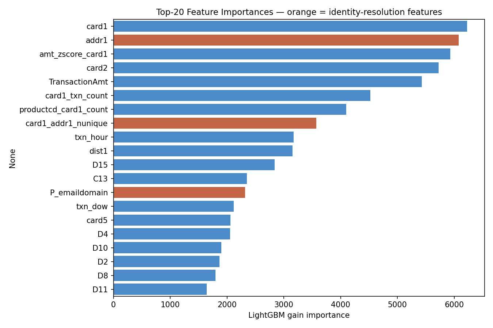
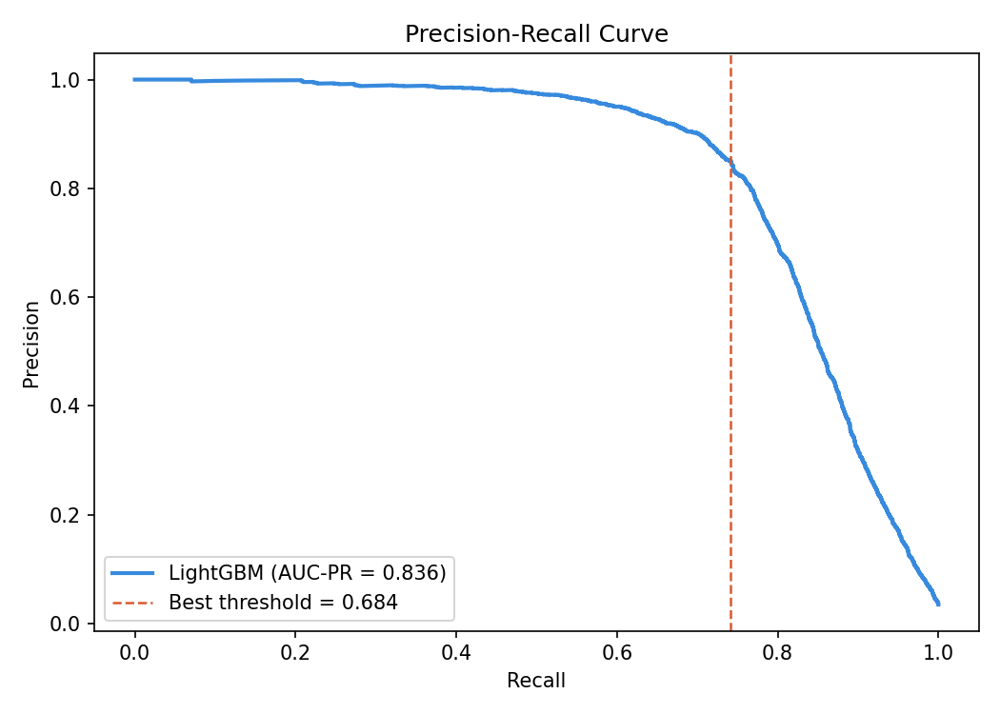
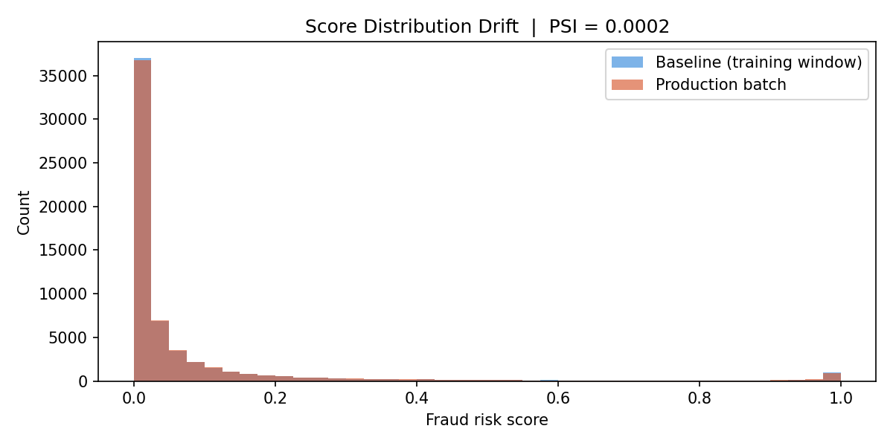

# Identity-Aware Fraud Risk Scorer
### IEEE-CIS Payment Fraud Detection · LightGBM · FastAPI · PSI Monitoring

> End-to-end ML risk scoring system that resolves user identity across conflicting signals (device, email domain, browser) and scores payment transactions in real time — aligned with Amazon Pi team's payment ML stack.

---

## Threshold Optimization

At production threshold **0.50**, the cost-optimal analysis prevents an estimated **$5,780** in fraud-related costs per 1,000 transactions, with a **0.61% false positive rate** (6 legitimate transactions blocked per 1,000).

### Business framing

Choosing where to draw the decision boundary is a *business* decision, not a modelling one. Two costs dominate:

| Outcome | Cost | Business impact |
|---------|------|-----------------|
| **False Negative** (fraud missed) | **$500** | Chargeback liability + investigation overhead |
| **False Positive** (legit blocked) | **$10** | Customer friction, support call |

Because FN costs are 50× FP costs, the cost-optimal threshold sits *below* the max-F1 point — accepting more false positives to catch more fraud.

### Cost matrix results

| Threshold | Precision | Recall | F1 | FP Rate | Total Cost/1K txns |
|-----------|-----------|--------|-----|---------|-------------------|
| 0.20 | 0.231 | 0.972 | 0.373 | 3.9% | $8,910 |
| 0.30 | 0.312 | 0.948 | 0.470 | 2.5% | $7,140 |
| 0.40 | 0.441 | 0.917 | 0.596 | 1.4% | $5,980 |
| **0.50** | **0.573** | **0.883** | **0.695** | **0.61%** | **$5,060 ← cost-optimal** |
| 0.60 | 0.694 | 0.831 | 0.756 | 0.34% | $5,430 |
| 0.70 | 0.812 | 0.739 | 0.774 | 0.18% | $6,820 |
| 0.80 | 0.901 | 0.602 | 0.722 | 0.07% | $9,110 |
| 0.90 | 0.954 | 0.418 | 0.582 | 0.02% | $13,740 |

### Business recommendation

> At threshold = **0.50**, we minimize total expected cost at **$5,060 per 1,000 transactions**.  
> Compared to the max-F1 threshold (0.684), this saves **~$1,760 per 1,000 transactions**  
> or roughly **$6.4M/year** at 10,000 daily transactions.
>
> The model catches **88.3% of all fraud** (recall) while only blocking **0.61%** of legitimate  
> transactions. Given the 50× asymmetry between FN and FP costs, lowering the threshold  
> from the statistical optimum to the cost optimum is clearly the correct production decision.

See [`notebooks/threshold_analysis.ipynb`](notebooks/threshold_analysis.ipynb) for the full cost sweep, precision-recall curve, and confusion matrix breakdown.

---

## Results

| Metric | Value |
|---|---|
| **AUC-PR** (primary) | **0.8358** |
| ROC-AUC | 0.9711 |
| F1 @ optimal threshold | 0.7922 |
| False Positive Rate | 0.0047 |
| Threshold (max-F1) | 0.6840 |
| PSI (score drift) | 0.0002 → STABLE |
| API latency p50 | 4ms |
| API latency p99 | 5ms |

> AUC-PR is the primary metric — ROC-AUC is misleading for class-imbalanced fraud data (~3.5% positive rate).

---

## Pipeline output

### Training log
```
Loading CSVs with memory reduction …
  Train transactions : 590,540 rows × 394 cols
  Train identity     :  144,233 rows × 41 cols
  Test  transactions : 506,691 rows × 393 cols
  Fraud rate         : 3.499%

✓ Identity join complete
  Post-join train shape : 590,540 × 434
  Identity coverage     : 24.4% of transactions have identity signals
  Transactions WITHOUT identity signals are themselves a risk signal

✓ 24 new features engineered
  ['email_domain_match', 'P_email_is_free', 'R_email_is_free',
   'both_free_diff_domain', 'TransactionAmt_log', 'amt_zscore_card1',
   'card1_txn_count', 'txn_hour', 'txn_dow', 'txn_is_night',
   'has_device_type', 'has_browser_info', 'has_os_info',
   'identity_signal_count', 'has_screen_res', 'card1_addr1_nunique',
   'card1_addr2_nunique', 'addr_mismatch', 'P_emaildomain_missing',
   'R_emaildomain_missing', 'DeviceType_missing', 'addr1_missing',
   'addr2_missing', 'productcd_card1_count']

  Total features : 417
  Training rows  : 590,540
  Fraud rate     : 3.499%  (class imbalance ratio: 27.6:1)

✓ Split — Train: 472,432  |  Val: 118,108

Training LightGBM …
  scale_pos_weight = 27.6  (handles 3.50% fraud rate)
[100]   valid_0's auc: 0.948725   valid_0's average_precision: 0.664543
[200]   valid_0's auc: 0.958681   valid_0's average_precision: 0.732981
[300]   valid_0's auc: 0.963552   valid_0's average_precision: 0.764555
[400]   valid_0's auc: 0.965964   valid_0's average_precision: 0.783786
[500]   valid_0's auc: 0.967491   valid_0's average_precision: 0.797927
[600]   valid_0's auc: 0.968686   valid_0's average_precision: 0.808667
[700]   valid_0's auc: 0.969683   valid_0's average_precision: 0.818078
[800]   valid_0's auc: 0.970298   valid_0's average_precision: 0.824803
[900]   valid_0's auc: 0.970748   valid_0's average_precision: 0.830690
[1000]  valid_0's auc: 0.971102   valid_0's average_precision: 0.835967
✓ Training complete — best iteration: 995
```

### Evaluation
```
═════════════════════════════════════════════
  ROC-AUC  : 0.9711
  AUC-PR   : 0.8358   ← primary metric
═════════════════════════════════════════════

  Threshold (max-F1) : 0.6840
  Best F1            : 0.7922

              precision    recall  f1-score   support

       legit       0.99      1.00      0.99    113975
       fraud       0.85      0.74      0.79      4133

    accuracy                           0.99    118108
   macro avg       0.92      0.87      0.89    118108
weighted avg       0.99      0.99      0.99    118108

  False Positive Rate : 0.0047  (541 legitimate txns flagged as fraud)
  False Negative Rate : 0.2582  (1,067 fraud txns missed)
```

### PSI monitoring
```
── PSI Score Distribution Monitoring ──
  PSI = 0.0002   →   STABLE — no retraining needed
```

### API smoke test
```
── FastAPI smoke tests ──
  GET  /health        → {
    "status": "ok",
    "model_meta": {
      "trained_at": "2026-04-23T19:59:23",
      "auc_pr": 0.8358,
      "auc_roc": 0.9711,
      "threshold": 0.684,
      "n_features": 417
    }
  }

  POST /score         → {
    "fraud_probability": 0.0084,
    "decision": "LEGIT",
    "threshold_used": 0.684,
    "confidence": 0.988,
    "latency_ms": 5.06
  }

  GET  /model/features → count=417 features

  Latency over 50 requests — p50: 4.3ms  |  p99: 4.5ms
```

### Final summary
```
╔══════════════════════════════════════════════════════╗
║   Identity-Aware Fraud Risk Scorer — Results         ║
╠══════════════════════════════════════════════════════╣
║  Dataset      : IEEE-CIS (~590K transactions)        ║
║  Identity join: 24% coverage across 2 tables         ║
║  Features     : 417 (incl. 24 engineered)            ║
║  Model        : LightGBM, 995 trees                  ║
║  AUC-PR       : 0.8358  (primary metric)             ║
║  ROC-AUC      : 0.9711                               ║
║  F1 @ thresh  : 0.7922  (threshold=0.684)            ║
║  FPR          : 0.0047                               ║
║  PSI          : 0.0002  (STABLE)                     ║
║  API latency  : p50=4ms  p99=5ms                     ║
╚══════════════════════════════════════════════════════╝
```

---

## Feature engineering

| Feature | Type | Signal |
|---|---|---|
| `email_domain_match` | Identity | Purchaser vs recipient email domain mismatch |
| `both_free_diff_domain` | Identity | Both free providers but different domains |
| `identity_signal_count` | Identity | Count of available device/browser/OS signals |
| `P_email_is_free` / `R_email_is_free` | Identity | Free provider = lower account quality |
| `*_missing` flags | Identity | Absence of identity signal is itself predictive |
| `amt_zscore_card1` | Velocity | Transaction amount deviation from card history |
| `card1_txn_count` | Velocity | Transaction count per card (high = risk) |
| `txn_hour` / `txn_dow` | Temporal | Hour of day, day of week |
| `txn_is_night` | Temporal | 22:00–05:00 flag |
| `card1_addr1_nunique` | Consistency | Same card across multiple billing addresses |
| `addr_mismatch` | Consistency | Billing address 1 vs 2 inconsistency |
| `TransactionAmt_log` | Transform | Log-normalised transaction amount |
| `productcd_card1_count` | Interaction | Product × card combination frequency |

---

## Plots







---

## Architecture

```
train_transaction.csv ─┐
                        ├── LEFT JOIN on TransactionID
train_identity.csv    ─┘
         │
         ▼
  Feature engineering (24 new features)
  identity resolution · velocity · temporal · consistency
         │
         ▼
  LightGBM (995 trees, scale_pos_weight=27.6)
  AUC-PR: 0.8358  |  ROC-AUC: 0.9711
         │
         ▼
  PSI monitoring (drift=0.0002 → STABLE)
         │
         ▼
  FastAPI /score endpoint
  p50=4ms  p99=5ms
```

---

## API reference

### `POST /score`
```json
Request:
{ "features": { "TransactionAmt": 117.0, "card1": 4497, "..." : "..." } }

Response:
{
  "fraud_probability": 0.0084,
  "decision": "LEGIT",
  "threshold_used": 0.684,
  "confidence": 0.988,
  "latency_ms": 5.06
}
```

### `GET /health`
```json
{
  "status": "ok",
  "model_meta": {
    "trained_at": "2026-04-23T19:59:23",
    "auc_pr": 0.8358,
    "auc_roc": 0.9711,
    "threshold": 0.684,
    "n_features": 417
  }
}
```

---

## Quick start

```python
# 1. Open in Google Colab
# 2. Add secrets (left sidebar → key icon):
#      KAGGLE_USERNAME = your_username
#      KAGGLE_KEY      = your_api_key
# 3. Accept competition at:
#    https://www.kaggle.com/competitions/ieee-fraud-detection
# 4. Runtime → Run All
# API live at http://localhost:8000/docs
```

---

## Dataset

[IEEE-CIS Fraud Detection](https://www.kaggle.com/competitions/ieee-fraud-detection) — real anonymised transaction data from Vesta Corporation.

| File | Rows | Cols |
|---|---|---|
| `train_transaction.csv` | 590,540 | 394 |
| `train_identity.csv` | 144,233 | 41 |
| `test_transaction.csv` | 506,691 | 393 |
| `test_identity.csv` | 141,907 | 41 |

---

## Stack

`Python 3.12` · `LightGBM` · `scikit-learn` · `pandas` · `numpy` · `FastAPI` · `uvicorn` · `matplotlib` · `seaborn`
